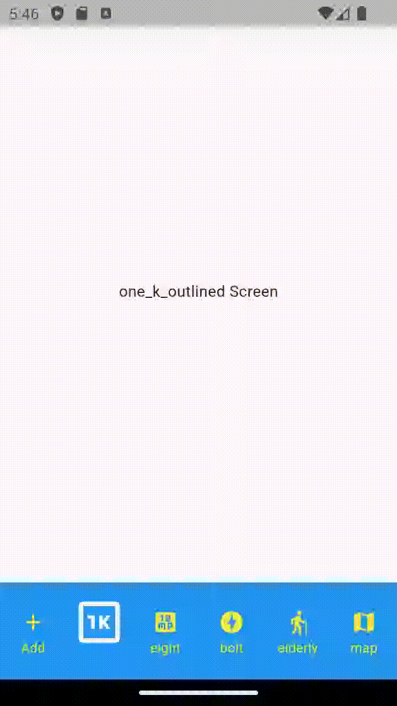

# Custom Bottom Navigation

A highly customizable Flutter bottom navigation widget with support for **2–6 tabs**, custom label styles, icon colors, font control, screen switching, and flexible UI customization.

---

# ✨ Features

* Support for 2–6 Tabs
* Dynamic Screen Switching
* Custom Icon Colors
* Custom Label Colors
* Full TextStyle Support
* Google Fonts Compatible
* Haptic Feedback
* Background & Elevation Control
* Show/Hide Labels
* onTap Callback
* Lightweight & Reusable

---


### 📽️ Preview GIF

 


```

---

# 📦 Installation

```yaml
dependencies:
  library_flutter_custombottomsheet: latest_version
```

```bash
flutter pub get
```

---

# 🚀 Usage

```dart
CustombottomsheetNavigation(
  backgroundColor: Colors.blue,

  selectedLabelColor: Colors.white,
  selectedIconColor: Colors.white,

  unselectedIconColor: Colors.yellow,
  unselectedLabelColor: Colors.yellowAccent,

  bottomsheetIcons: icons,
  screens: Screens,
  iconNames: iconNames,

  defaultIndex: 1,

  selectedLabelStyle: GoogleFonts.lobster(),

  showSelectedLabel: false,
  selectedFontSize: 50,
)
```

---

# 🛠 Parameters

| Parameter            | Type            | Description           |
| -------------------- | --------------- | --------------------- |
| bottomsheetIcons     | List<IconData?> | Navigation icons      |
| screens              | List<Widget>    | Screens for tabs      |
| iconNames            | List<String?>?  | Labels                |
| defaultIndex         | int             | Initial tab index     |
| backgroundColor      | Color?          | Background color      |
| elevation            | double?         | Shadow                |
| selectedIconColor    | Color?          | Active icon color     |
| unselectedIconColor  | Color?          | Inactive icon color   |
| selectedLabelColor   | Color?          | Active label color    |
| unselectedLabelColor | Color?          | Inactive label color  |
| showSelectedLabel    | bool            | Show active label     |
| showUnselectedLabel  | bool            | Show inactive label   |
| selectedFontSize     | double          | Active font size      |
| unselectedFontSize   | double          | Inactive font size    |
| selectedLabelStyle   | TextStyle?      | Custom active style   |
| unselectedLabelStyle | TextStyle?      | Custom inactive style |
| onItemTap            | Function(int)?  | Tap callback          |
| hapticFeedback       | bool            | Tap vibration         |

---

# ⚠️ Validations

✔ Tabs allowed: **2–6 only**
✔ Icons and Screens must match
✔ Labels (if provided) must match length

---
# 📄 License

```
MIT License
 
Copyright (c) 2026 Excelsior Technologies
 
Permission is hereby granted, free of charge, to any person obtaining a copy
of this software and associated documentation files (the "Software"), to deal
in the Software without restriction, including without limitation the rights
to use, copy, modify, merge, publish, distribute, sublicense, and/or sell
copies of the Software, and to permit persons to whom the Software is
furnished to do so, subject to the following conditions:
 
The above copyright notice and this permission notice shall be included in all
copies or substantial portions of the Software.
 
THE SOFTWARE IS PROVIDED "AS IS", WITHOUT WARRANTY OF ANY KIND, EXPRESS OR
IMPLIED, INCLUDING BUT NOT LIMITED TO THE WARRANTIES OF MERCHANTABILITY,
FITNESS FOR A PARTICULAR PURPOSE AND NONINFRINGEMENT. IN NO EVENT SHALL THE
AUTHORS OR COPYRIGHT HOLDERS BE LIABLE FOR ANY CLAIM, DAMAGES OR OTHER
LIABILITY, WHETHER IN AN ACTION OF CONTRACT, TORT OR OTHERWISE, ARISING FROM,
OUT OF OR IN CONNECTION WITH THE SOFTWARE OR THE USE OR OTHER DEALINGS IN THE
SOFTWARE.
```

